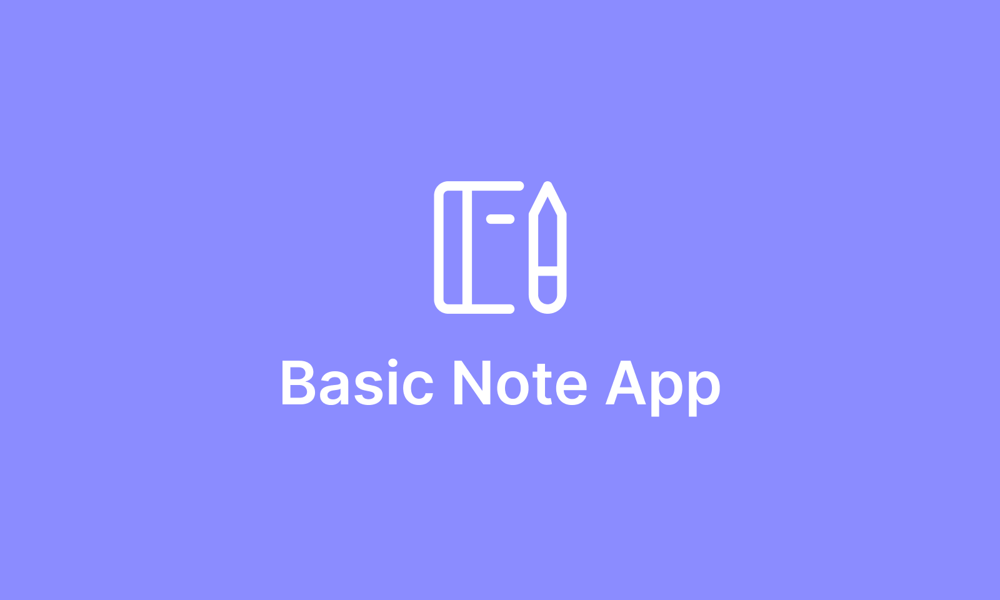

# Basic Note App

This project contains necessary documentation & code to get you qickly started with your internship project 🚀

You are going to build a note-taking application for Android using Kotlin and modern technologies listed [here](#tech-stack). Before you get started you must complete the installation step.

You can find design files in [Figma](https://www.figma.com/file/6m1vGJThLxr1VRTOVQNr8m/BasicNote-App).

## Installation

This project requires a backend to be deployed on Heroku. Follow these steps:

1. You need to have Heroku Account for deploy project to Heroku. If you don't have one create from [here](https://www.heroku.com/)
2. Login Heroku
3. Click Deploy to Heroku button & Complete deploy
4. After you have successfully deployed you will get an url looks like this `https://your-project.herokuapp.com`. You are going to use this url for all backend operations
5. Download [Postman](https://www.postman.com/) & Import this [Postman Collection](docs/PostmanCollection.json)
6. Add a Postman variable named `api_url` with the value you get from Heroku with the api suffix like this: `https://your-project.herokuapp.com/api/`
7. Add a Postman variable named `token`. You can leave this field empty for now but after you have successfully login and get a new token you are going to set this variable with it.
8. Thats all! You can start exploring endpoints.

## Tech Stack

These are the technologies & 3rd party libraries we suggest to use in your project 👇

* [Kotlin](https://kotlinlang.org/) as a programming language
* [Dagger Hilt](https://dagger.dev/hilt/) for dependency injection
* [Coroutines](https://kotlinlang.org/docs/coroutines-overview.html) with [Flow](https://kotlin.github.io/kotlinx.coroutines/kotlinx-coroutines-core/kotlinx.coroutines.flow/-flow/) for asynchronous operations
* [OkHttp](https://square.github.io/okhttp/) & [Retrofit](https://square.github.io/retrofit/) for making network requests
* [Jetpack Compose](https://developer.android.com/jetpack/compose) for building th UI (Optional)
* [Navigation Component](https://www.google.com/search?q=jetpack+navigation&oq=Jetpack+Navigation&aqs=chrome.0.0i512l6j69i60l2.2348j0j7&sourceid=chrome&ie=UTF-8) for navigating screens
